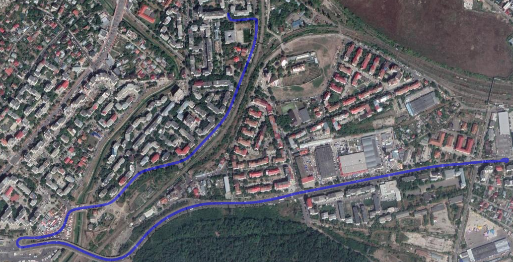
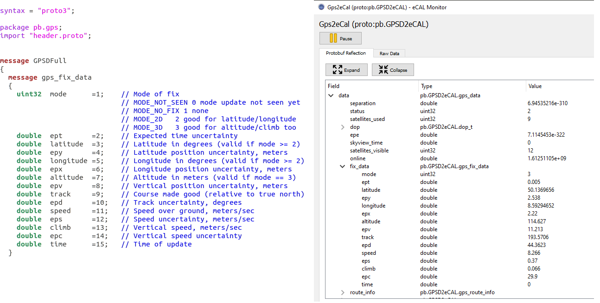

# gpsd2ecal
 1. [About](#about)
  - Gps car trajectory
  - gpsd2ecal messages 
2. [Getting started](#getting-started)
  - Install the dependencies
  - How to build
  - How to use it
  - Program settings
## About 
  `Gpsd2ecal` is a tool which collects GPS information on Linux based systems and sends it to `eCAL` via `Google protobuf messages`. 

The project does not provide any driver, but instead it uses the Linux opensource tool gpsd (gps-daemon) which contains drivers for any GPS device like for e.g Ublox or built-in GPS cards. [Here](https://gpsd.gitlab.io/gpsd/hardware.html) you can find a list of compatible receivers.

Given the fact that gpsd is widespread, the `gpsd2ecal` will have the same "coverage", with no other dependencies involved.

Also, `gpsd2ecal` is designed in a way that provides a lot of flexibility to extend it and adapt it to the user needs.  
This means that one could implement custom messages within `gpsd2ecal` just by:  
- adding a new proto file  
- and a new C++ class that maps the information for `eCAL`.

If the user wants to collect data from a different driver, then the one provided by the gpsd, this is also possible by a separate implementation of Idevice interface within `gpsd2ecal`, without changing the project structure.
#### Gps car trajectory

The below trajectory was displayed using a kml viewer. Data acquisition was done with  an `U-blox 6 receiver` and [eCAL Recorder](https://continental.github.io/ecal/getting_started/recorder.html#) to record the sent data. 

#### gpsd2ecal messages 
After you have created the measurements, you can replay the data using the [eCAL Player](https://continental.github.io/ecal/getting_started/player.html) and view it with  [eCAL Monitor](https://continental.github.io/ecal/getting_started/monitor.html).

## Getting started 

### Install the dependencies for Ubuntu 18.04:

 1.  `Install` [eCAL](https://continental.github.io/ecal/getting_started/setup.html#fa-ubuntu-installing-ecal-on-ubuntu) and follow the setup steps 
 2.  `Run` the below commands:
----

    sudo apt-get update
    sudo apt-get install cmake libprotobuf-dev protobuf-compiler libprotoc-dev libprotoc10  
    sudo apt-get install gpsd-clients gpsd libgps-dev

### Install the dependencies for Ubuntu 20.04:

 1.  `Install` [eCAL](https://continental.github.io/ecal/getting_started/setup.html#fa-ubuntu-installing-ecal-on-ubuntu) and follow the setup steps 
 2.  `Run` the below commands:
----

    sudo apt-get update
    sudo apt-get install cmake libprotobuf-dev protobuf-compiler libprotoc-dev build-essential
    sudo apt-get install gpsd-clients gpsd libgps-dev
### How to build:
-  run `make_all.sh` from the [build_scripts](build_scripts) folder.

###  How to use it:

Simply run the `gpsd2ecal` application.

You can see the menu information by running the following command `./gpsd2ecal --h` :

    Parameters: 
    --h            --help           Display this help 
    --i PATH       --ini PATH       Use the path to an ini file to load the settings. 
To see sent messages to eCAL just type in a terminal `ecal_mon_gui` to open eCAL Monitor.
### How to initialize the program settings:
You can edit the [gps2ecal.ini](ini/gps2ecal.ini) file to change the settings of the program. 
There are two sections: 
- general: refers to the `eCAL` message settings
- gpsd : refers to the gpsd port and address

#### [general]
Here it is possible to change the gps source and the frequency of the sent out messages, but also possible to set the already existing publishers you want to use and add new ones. But keep in mind that if new publisher are added the `gpsd2ecal` code must be extended.

    ; ecal publishers
    gps2ecal_full = true
    gps2ecal_reduced = true 
In the following section the user can set the topic name:

    ; ecal messages
    gps2ecal_full_name = Gpsd2eCalFull
    gps2ecal_reduced_name = Gpsd2eCalReduced

#### [gpsd]
The GPS receivers are attached to a host computer through serial or USB ports and this makes the data available on TCP port `2947`. The user can change this settings, if required, in the below code block:

    ; address: 127.0.0.1
    ; address: localhost
    ; address on which gpsd can be reached
    address = 127.0.0.1
    
    ; port:
    ; port on which gpsd can be reached
    port = 2947

